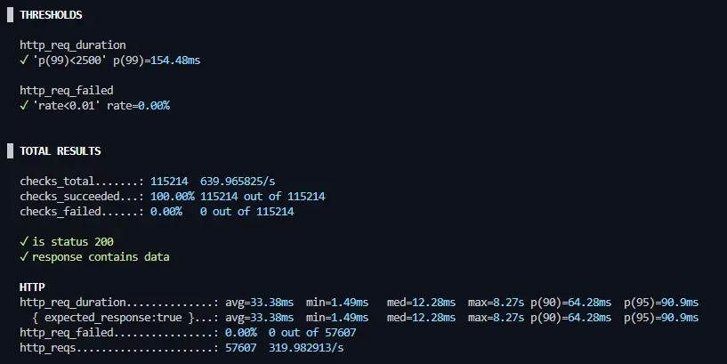

# 대용량 데이터 조회 성능 개선

## 요약
- 100만 건 데이터 환경에서 검색 API가 병목 발생
- LIKE '%keyword%' 구조로 Full Table Scan 발생
- 탐색 구조 변경을 통해 Index 기반 탐색으로 전환
- p99 60초 → 154ms, Error Rate 75% → 0% 개선

---

## 1. 문제 재현

### 테스트 환경
- 데이터 규모: 100만 건
- 부하 도구: K6
- VU: 100 ~ 200 기준

> 자세한 환경(인스턴스 스펙)은 [서버 인프라 구성도](https://www.notion.so/2f555588581980378187cd547219c018?source=copy_link) 문서를 참고

### 증상
- 키워드 검색 시 p99 응답 시간 60s 초과
- Error Rate 약 75% 발생
- TPS 급격히 저하

---

## 2. 원인 분석

### 실행 계획
- `EXPLAIN (ANALYZE, BUFFERS)` 결과 **Full Table Scan** 중심 실행 계획 확인
- 선행 와일드카드(`%keyword%`) 특성상 탐색 시작 지점을 특정할 수 없어 **B-Tree 인덱스 활용 불가**

```sql
Parallel Seq Scan on tb_coupon c1_0
Filter: (((title)::text ~~ '%NIKE%'::text) AND ((use_status)::text <> 'ALL'::text))
Rows Removed by Filter: 285,781
Buffers: shared hit=15,277 read=19,132
```

### 분석 내용
- 전체 테이블을 순차 탐색
- I/O 병목 발생 및 버퍼 캐시 효율이 떨어지는 패턴 확인
- 부하 증가 시 응답 시간 급증

> - 초기에는 복합 인덱스 추가 및 조건 최적화를 시도했으나, 선행 와일드카드(`%keyword%`) 특성상 탐색 시작 지점을 특정할 수 없음
> - B-Tree 인덱스는 좌측 정렬 특성을 가지기 때문에, 이와 같은 조건에서는 인덱스를 활용할 수 없다고 판단

---

## 3. 구조 변경

### 3-1. 검색 조건 정규화
- Keyword 전용 테이블을 분리하여 검색 대상/조건을 명확화

### 3-2. 탐색 방식 변경
- 전방 일치(`keyword%`) 기반으로 변경하여 인덱스를 사용할 수 있는 형태로 전환

### 3-3. 애플리케이션 레벨 비용 감소
- Projection 적용으로 불필요한 엔티티 로딩/매핑 비용 감소
- 반복 조회는 Redis 캐시로 DB 접근을 완화

---

## 4. 개선 결과



| 항목 | 개선 전 | 개선 후 |
|------|--------|--------|
| p99 | 60s+ | 154ms |
| Error Rate | 75% | 0% |
| TPS | 급감 | 300+ |

---

## 5. 배운 점
- 인덱스 “추가”만으로는 해결이 어려운 병목이 존재
- 실행 계획 분석을 통해 실제 탐색 방식을 확인하는 것이 중요
- 데이터 구조와 탐색 방식이 성능에 직접적인 영향을 준다는 점을 체감

---

## 📘 참고 자료 (Notion)
> - [대규모 데이터 조회 성능 튜닝](https://www.notion.so/2fc55588581980c3bebee8aa571b661e?source=copy_link)
