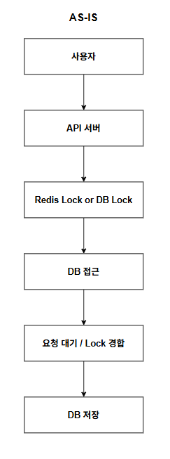
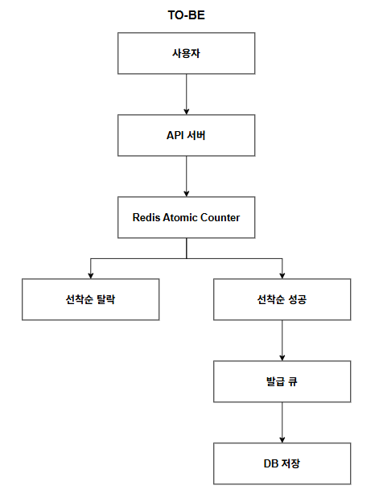
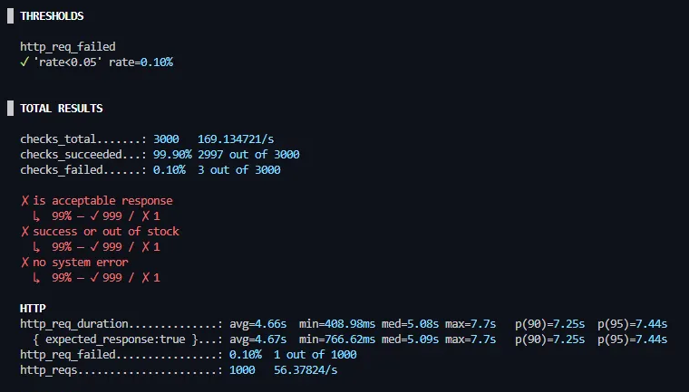

# 선착순 쿠폰 발급 동시성 제어

## 요약
- 동시 1000명 요청 환경에서 락 경합 발생
- 트랜잭션 내부 경쟁 구조가 병목 원인
- Redis Atomic Counter 기반 선처리 구조로 전환
- 초과 발급 0건 달성

---

## 1. 문제 재현

### 테스트 환경
- 동시 요청: 1000 VU
- 목표: 초과 발급 없이 안정적 처리

> 자세한 환경(인스턴스 스펙)은 [서버 인프라 구성도](https://www.notion.so/2f555588581980378187cd547219c018?source=copy_link) 문서를 참고

### 증상
- 동시 1000명 발급 요청에서 응답 지연 및 실패 증가
- DB 락 경합 및 커넥션 대기 증가

---

## 2. 초기 설계
- DB 비관적 락으로 재고 차감 보호
- Redis 분산 락으로 중복 처리 방지

### 한계
- 동시 요청이 증가할수록 트랜잭션 점유 시간 및 락 대기 시간 증가
- 커넥션 풀 대기가 늘어나며 처리량이 급감

> 즉, 경쟁을 트랜잭션 내부에서 해결하는 구조가 병목의 원인

---

## 3. 구조 전환
경쟁을 트랜잭션 내부에서 해결하는 대신, **트랜잭션 진입 이전 단계에서 선착순을 판단하도록 구조를 변경**

### 3-1. 선착순 사전 판단
- Redis Atomic Counter로 선착순 여부를 먼저 판단
- “발급 가능” 요청만 DB로 진입하도록 구성

> Redis는 단일 스레드 기반으로 Atomic 연산을 보장하므로, 경쟁 상태 없이 선착순 카운팅을 처리

### 3-2. 트랜잭션 범위 축소
- DB 트랜잭션은 **재고 차감 + 발급 이력 저장** 단계로 한정

### 3-3. 비동기 분리
- 발급 처리/이력 저장을 큐 기반으로 분리

---

## 4. 결과

- 동시 1000 VU 환경 초과 발급 0건
- 요청 1000건 중 999건 정상 처리
- 1건 실패는 네트워크 I/O 오류
- 비즈니스 로직 오류 없음

---

## 5. 배운 점
- 락을 강화하는 방식이 항상 최선은 아님
- 트랜잭션 경계를 어디에 두느냐가 처리량과 안정성에 직접적인 영향을 줌
- 요청 흐름을 재설계하는 것이 병목 해결의 핵심이 될 수 있음

---

## 📘 참고 자료 (Notion)
> - [실시간 쿠폰 발급 동시성 제어](https://www.notion.so/2fc55588581980d4b637f5ea13085351?source=copy_link) 
